# C# / .NET Learning Roadmap Chart

This Mermaid chart visualizes the comprehensive learning path to become an advanced C# / .NET developer based on your learning plans.

```mermaid
flowchart TD
    Start([🚀 Start Your C# Journey]) --> Foundation{Have Basic C#?}
    
    Foundation -->|No| BasicCs[📚 Learn C# Basics]
    Foundation -->|Yes| Phase1
    BasicCs --> Phase1
    
    %% Phase 1: Language Mastery
    Phase1["🧭 Phase 1: Language Mastery<br/>2-3 weeks"] --> P1Topics
    P1Topics["🔹 Advanced Language Features<br/>• Span T, Memory T<br/>• ref, in, ref struct<br/>• Nullable reference types<br/>• Source generators<br/>• Expression trees<br/>• Unsafe code & pointers"]
    P1Topics --> P1Project["📦 SafeBuffer Project<br/>Memory-efficient buffer wrapper"]
    P1Project --> Phase2
    
    %% Phase 2: CLR & Runtime
    Phase2["🚀 Phase 2: CLR & Runtime<br/>2-3 weeks"] --> P2Topics
    P2Topics["🔹 Runtime Internals<br/>• JIT, IL, GC internals<br/>• Assembly loading & metadata<br/>• Reflection, custom attributes<br/>• Performance profiling"]
    P2Topics --> P2Project["📦 DynamicCommandExecutor<br/>Runtime assembly loading CLI"]
    P2Project --> Phase3
    
    %% Phase 3: ASP.NET Core
    Phase3["🧱 Phase 3: Advanced ASP.NET<br/>3-4 weeks"] --> P3Topics
    P3Topics["🔹 Web Development<br/>• Middleware, filters, DI<br/>• Minimal APIs vs MVC<br/>• SignalR & gRPC<br/>• Advanced model binding"]
    P3Topics --> P3Project["📦 MicroAPI Hub<br/>Modular web API with plugins"]
    P3Project --> Phase4
    
    %% Phase 4: Architecture
    Phase4["🧠 Phase 4: Design & Architecture<br/>3-4 weeks"] --> P4Topics
    P4Topics["🔹 Enterprise Patterns<br/>• DDD, Onion Architecture<br/>• MediatR patterns, CQRS<br/>• Repository/Unit of Work<br/>• Clean Architecture"]
    P4Topics --> P4Project["📦 DomainShop<br/>E-commerce with DDD & CQRS"]
    P4Project --> Phase5
    
    %% Phase 5: Concurrency
    Phase5["🔄 Phase 5: Concurrency & Performance<br/>2-3 weeks"] --> P5Topics
    P5Topics["🔹 Async Programming<br/>• async/await, ValueTask<br/>• System.IO.Pipelines<br/>• Channels<br/>• Benchmarking"]
    P5Topics --> P5Project["📦 PipeCrawler<br/>High-performance web scraper"]
    P5Project --> Phase6
    
    %% Phase 6: Diagnostics
    Phase6["📊 Phase 6: Diagnostics & Tooling<br/>2-3 weeks"] --> P6Topics
    P6Topics["🔹 Developer Tools<br/>• BenchmarkDotNet<br/>• Logging frameworks<br/>• dotTrace, PerfView<br/>• Roslyn analyzers"]
    P6Topics --> P6Project["📦 AnalyzerPack<br/>Custom Roslyn analyzers"]
    P6Project --> Phase7
    
    %% Phase 7: DevOps (Optional)
    Phase7["🌐 Phase 7: DevOps & Distributed<br/>Optional/Advanced"] --> P7Topics
    P7Topics["🔹 Production Systems<br/>• Dockerizing .NET apps<br/>• Azure/AWS deployment<br/>• Orleans or Akka.NET<br/>• OpenTelemetry tracing"]
    P7Topics --> P7Project["📦 OrleansMonitor<br/>Distributed job runner"]
    
    %% Parallel Advanced Topics
    Phase1 -.-> AdvancedTopics["🎯 Advanced Topics<br/>Parallel Learning"]
    Phase2 -.-> AdvancedTopics
    Phase3 -.-> AdvancedTopics
    
    AdvancedTopics --> AT1["🧠 Memory & Performance<br/>• ArrayPool, MemoryPool<br/>• Allocation-free patterns<br/>• Struct optimizations"]
    AdvancedTopics --> AT2["🔗 Data & LINQ<br/>• IQueryable vs IEnumerable<br/>• Custom LINQ providers<br/>• Expression manipulation"]
    AdvancedTopics --> AT3["🛠️ Systems Programming<br/>• P/Invoke, native interop<br/>• Networking, sockets<br/>• Reflection.Emit"]
    
    %% Capstone Project
    P7Project --> Capstone
    AT1 --> Capstone
    AT2 --> Capstone
    AT3 --> Capstone
    
    Capstone["🧩 Capstone Project<br/>1-2 months<br/>Enterprise SaaS Application"]
    Capstone --> CapstoneFeatures
    CapstoneFeatures["📋 Capstone Features<br/>• ASP.NET Core backend<br/>• Admin dashboard Blazor<br/>• SignalR notifications<br/>• Microservice architecture<br/>• Containerized deployment"]
    
    %% Expert Level
    CapstoneFeatures --> ExpertLevel["🌟 Expert Level<br/>Continuous Learning"]
    ExpertLevel --> Expert1["📚 Contribute to OSS<br/>dotnet/runtime, roslyn"]
    ExpertLevel --> Expert2["📖 Study CLR via C#<br/>Jeffrey Richter"]
    ExpertLevel --> Expert3["👥 Mentor & Review<br/>Code reviews, teaching"]
    ExpertLevel --> Expert4["🔬 Build Libraries<br/>Real-world OSS libraries"]
    
    %% Continuous Learning Loop
    Expert1 --> ContinuousLearning["🔄 Continuous Improvement"]
    Expert2 --> ContinuousLearning
    Expert3 --> ContinuousLearning
    Expert4 --> ContinuousLearning
    ContinuousLearning -.-> Phase1
    
    %% Study Methodology
    Start --> StudyMethod["📋 Study Methodology"]
    StudyMethod --> Daily["📅 Daily: 1-2 hrs focused study"]
    StudyMethod --> Weekly["📆 Weekly: Deep-dive blog posts"]
    StudyMethod --> Monthly["📊 Monthly: Build projects"]
    StudyMethod --> LongTerm["🎯 Long-term: OSS contributions"]
    
    %% Styling
    classDef phaseBox fill:#e1f5fe,stroke:#01579b,stroke-width:2px,color:#000
    classDef projectBox fill:#f3e5f5,stroke:#4a148c,stroke-width:2px,color:#000
    classDef topicBox fill:#e8f5e8,stroke:#1b5e20,stroke-width:2px,color:#000
    classDef expertBox fill:#fff3e0,stroke:#e65100,stroke-width:2px,color:#000
    classDef methodBox fill:#fce4ec,stroke:#880e4f,stroke-width:2px,color:#000
    
    class Phase1,Phase2,Phase3,Phase4,Phase5,Phase6,Phase7 phaseBox
    class P1Project,P2Project,P3Project,P4Project,P5Project,P6Project,P7Project,Capstone projectBox
    class P1Topics,P2Topics,P3Topics,P4Topics,P5Topics,P6Topics,P7Topics,AT1,AT2,AT3 topicBox
    class ExpertLevel,Expert1,Expert2,Expert3,Expert4 expertBox
    class StudyMethod,Daily,Weekly,Monthly,LongTerm methodBox
```

## Timeline Overview

| Phase | Duration | Focus Area | Key Output |
|-------|----------|------------|------------|
| Phase 1 | 2-3 weeks | Language Mastery | SafeBuffer Project |
| Phase 2 | 2-3 weeks | CLR & Runtime | DynamicCommandExecutor |
| Phase 3 | 3-4 weeks | ASP.NET Core | MicroAPI Hub |
| Phase 4 | 3-4 weeks | Architecture | DomainShop (DDD/CQRS) |
| Phase 5 | 2-3 weeks | Concurrency | PipeCrawler |
| Phase 6 | 2-3 weeks | Diagnostics | AnalyzerPack |
| Phase 7 | Variable | DevOps (Optional) | OrleansMonitor |
| Capstone | 1-2 months | Integration | Enterprise SaaS |

**Total Estimated Time:** 4-6 months for core phases + 1-2 months for capstone

## Key Learning Paths

1. **Sequential Path:** Follow phases 1-7 in order for structured learning
2. **Parallel Path:** Combine core phases with advanced topics for faster progression  
3. **Project-Driven:** Focus on building projects while learning concepts
4. **Expert Path:** Continuous improvement through OSS contributions and mentoring

## Study Recommendations

- **Daily:** 1-2 hours of focused study + coding
- **Weekly:** One deep-dive exploration of source code or advanced topics
- **Monthly:** Complete one project applying new knowledge
- **Quarterly:** Contribute to open source or write technical content